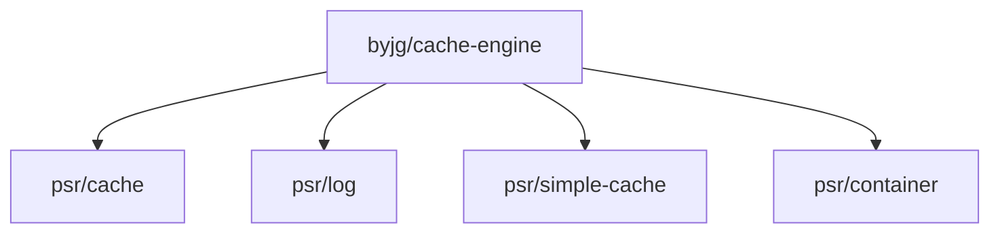

# Cache Engine

[](https://github.com/byjg/php-cache-engine/actions/workflows/phpunit.yml)
[](http://opensource.byjg.com)
[](https://github.com/byjg/php-cache-engine/)
[](https://opensource.byjg.com/opensource/licensing.html)
[](https://github.com/byjg/php-cache-engine/releases/)


A multi-purpose cache engine PSR-6 and PSR-16 implementation with several drivers.

## PSR-16
 
PSR-16 defines a Simple Cache interface with less verbosity than PSR-6. Below a list
of engines available in this library that is PSR-16 compliant:

{:.table}

| Class                                                                            | Description                                                         |
|:---------------------------------------------------------------------------------|:--------------------------------------------------------------------|
| [\ByJG\Cache\Psr16\NoCacheEngine](docs/class-no-cache-engine.md)                 | Do nothing. Use it for disable the cache without change your code   |
| [\ByJG\Cache\Psr16\ArrayCacheEngine](docs/class-array-cache-engine.md)           | Local cache only using array. It does not persists between requests |
| [\ByJG\Cache\Psr16\FileSystemCacheEngine](docs/class-filesystem-cache-engine.md) | Save the cache result in the local file system                      |
| [\ByJG\Cache\Psr16\MemcachedEngine](docs/class-memcached-engine.md)              | Uses the Memcached as the cache engine                              |
| [\ByJG\Cache\Psr16\RedisCachedEngine](docs/class-redis-cache-engine.md)          | uses the Redis as cache                                             |
| [\ByJG\Cache\Psr16\SessionCachedEngine](docs/class-session-cache-engine.md)      | uses the PHP session as cache                                       |
| [\ByJG\Cache\Psr16\ShmopCachedEngine](docs/class-shmop-cache-engine.md)          | uses the shared memory area for cache                               |

To create a new Cache Instance just create the proper cache engine and use it:

```php
<?php
$cache = new \ByJG\Cache\Psr16\FileSystemCacheEngine();

// And use it:
if ($cache->has('key')) {
    // Do the complex code to get the value to be cached
    $object = callComplexCode();
    
    // Save to cache
    $cache->set('key', $object);
};
$object = $cache->get('key');
```

See more PSR-16 examples [here](docs/basic-usage-psr16-simplecache.md)

## PSR-6 

The PSR-6 implementation use the engines defined above. PSR-6 is more verbosity and
have an extra layer do get and set the cache values. 

You can use one of the factory methods to create a instance of the CachePool implementation:

```php
<?php
$cachePool = \ByJG\Cache\Factory::createFilePool();
```

 OR just create a new CachePool and pass to the constructor an instance of a PSR-16 compliant class:

```php
$cachePool = new CachePool(new FileSystemCacheEngine());
```

See more PSR-6 examples [here](docs/basic-usage-psr6-cachepool.md)

## List of Available Factory Commands

**Note: All parameters are optional**

{:.table}

| Engine           | Factory Command                                                       |
|:-----------------|:----------------------------------------------------------------------|
| No Cache         | Factory::createNullPool($prefix, $bufferSize, $logger);               |
| Array            | Factory::createArrayPool($bufferSize, $logger);                       |
| File System      | Factory::createFilePool($prefix, $bufferSize, $logger);               |
| Memcached        | Factory::createMemcachedPool($servers[], $bufferSize, $logger);       |
| Session          | Factory::createSessionPool($prefix, $bufferSize, $logger);            |
| Redis            | Factory::createRedisCacheEngine($server, $pwd, $bufferSize, $logger); |
| Shmop            | Factory::createShmopPool($config[], $bufferSize, $logger);            |

The Common parameters are:

- logger: A valid instance that implement the LoggerInterface defined by the PSR/LOG
- bufferSize: the Buffer of CachePool
- prefix: A prefix name to compose the KEY physically 
- servers: An array of memcached servers. E.g.: `[ '127.0.0.1:11211' ]` 
- config: Specific setup for shmop. E.g.: `[ 'max-size' => 524288, 'default-permission' => '0700' ]`

## Logging cache commands
 
You can add a PSR Log compatible to the constructor in order to get Log of the operations

See log examples [here](docs/setup-log-handler.md)

## Use a PSR-11 container to retrieve the cache keys

You can use a PSR-11 compatible to retrieve the cache keys. Once is defined, only the keys defined 
in the PSR-11 will be used to cache. 

```php
<?php
$fileCache = new \ByJG\Cache\Psr16\FileSystemCacheEngine()
$fileCache->withKeysFromContainer(new SomePsr11Implementation());
```

After the PSR-11 container is defined, when I run:

```php
$value = $fileCache->get('my-key');
```

The key `my-key` will be retrieved from the PSR-11 container and
the value retrieved will be used as the cache key.
If it does not exist in the PSR-11 container, an exception will be thrown.


## Install

Just type: 

```
composer require "byjg/cache-engine=4.9.*"
```


## Running Unit Testes

```
vendor/bin/phpunit --stderr
```

**Note:** the parameter `--stderr` after `phpunit` is to permit run the tests on SessionCacheEngine.  

## Dependencies


----
[Open source ByJG](http://opensource.byjg.com)
