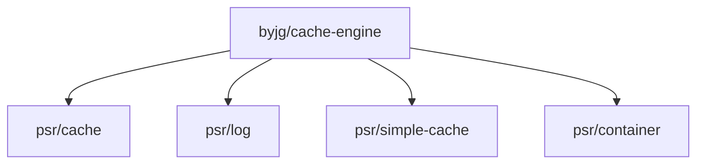

# Cache Engine

[](https://github.com/sponsors/byjg)
[](https://github.com/byjg/php-cache-engine/actions/workflows/phpunit.yml)
[](http://opensource.byjg.com)
[](https://github.com/byjg/php-cache-engine/)
[](https://opensource.byjg.com/opensource/licensing.html)
[](https://github.com/byjg/php-cache-engine/releases/)

A powerful, versatile cache implementation providing both PSR-6 and PSR-16 interfaces with support for multiple storage drivers.

## Key Features

- **PSR-16 Simple Cache interface** - Simple, straightforward caching API
- **PSR-6 Cache Pool interface** - More verbose caching with fine-grained control
- **Multiple storage backends** - Choose from memory, file system, Redis, Memcached and more
- **Atomic operations** - Support for increment, decrement and add operations in compatible engines
- **Garbage collection** - Automatic cleanup of expired items 
- **PSR-11 container support** - Retrieve cache keys via dependency container
- **Logging capabilities** - PSR-3 compatible logging of cache operations

## Quick Start

```bash
composer require "byjg/cache-engine"
```

```php
// PSR-16 Simple Cache
$cache = new \ByJG\Cache\Psr16\FileSystemCacheEngine();
$cache->set('key', 'value', 3600); // Cache for 1 hour
$value = $cache->get('key');

// PSR-6 Cache Pool
$pool = \ByJG\Cache\Factory::createFilePool();
$item = $pool->getItem('key');
if (!$item->isHit()) {
    $item->set('value');
    $item->expiresAfter(3600);
    $pool->save($item);
}
$value = $item->get();
```

## Documentation

### Getting Started
- [PSR-16 Simple Cache Usage](docs/basic-usage-psr16-simplecache.md)
- [PSR-6 Cache Pool Usage](docs/basic-usage-psr6-cachepool.md)

### Available Cache Engines
| Engine                                                              | Description                                             |
|:--------------------------------------------------------------------|:--------------------------------------------------------|
| [NoCacheEngine](docs/class-no-cache-engine.md)                      | No-op engine for disabling cache without code changes   |
| [ArrayCacheEngine](docs/class-array-cache-engine.md)                | In-memory array cache (non-persistent between requests) |
| [FileSystemCacheEngine](docs/class-filesystem-cache-engine.md)      | File system based caching                               |
| [MemcachedEngine](docs/class-memcached-engine.md)                   | Memcached distributed caching                           |
| [RedisCacheEngine](docs/class-redis-cache-engine.md)                | Redis-based caching                                     |
| [SessionCacheEngine](docs/class-session-cache-engine.md)            | PHP session-based caching                               |
| [TmpfsCacheEngine](docs/class-tmpfs-cache-engine.md)                | Tmpfs-based caching                                     |
| [ShmopCacheEngine](docs/class-shmop-cache-engine.md)                | Shared memory caching (deprecated)                      |
| [KeyValueCacheEngine](https://github.com/byjg/php-anydataset-nosql) | S3-Like or CloudflareKV storage (separate package)      |

### Advanced Features
- [Atomic Operations](docs/atomic-operations.md)
- [Garbage Collection](docs/garbage-collection.md)
- [Logging](docs/setup-log-handler.md)
- [PSR-11 Container Usage](docs/psr11-usage.md)

## Running Unit Tests

```
vendor/bin/phpunit --stderr
```

**Note:** The `--stderr` parameter is required for SessionCacheEngine tests to run properly.

## Dependencies



----
[Open source ByJG](http://opensource.byjg.com)
